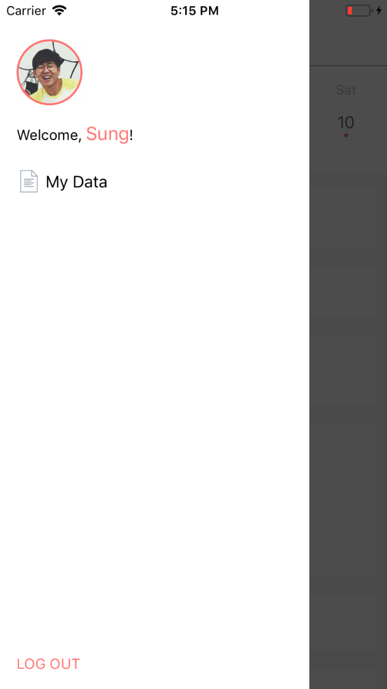

# react-native-toi

## Iteration 1

### Login Screen


## Iteration 2

- signup, login, logout implemented
- calendar implemented
- drawer menu implemented

### Homescreen implemented


### Drawer menu implemented



## Installation

### Try it out on your Device

Try it with Exponent: https://exp.host/@sungwoopark95/react-native-toi

### Run it locally

To install, there are two steps:

1. Install Exponent XDE [following this
guide](https://docs.getexponent.com/versions/latest/introduction/installation.html).
Also install the Exponent app on your phone if you want to test it on your device, otherwise you don't need to do anything for the simulator.

2. Clone this repo and run `npm install`

```bash
git clone git@github.com:baekchun/Toi.git toi
cd toi/app/react-native-toi

npm install //or yarn install
```

3. Open the project with Exponent XDE and run it.

